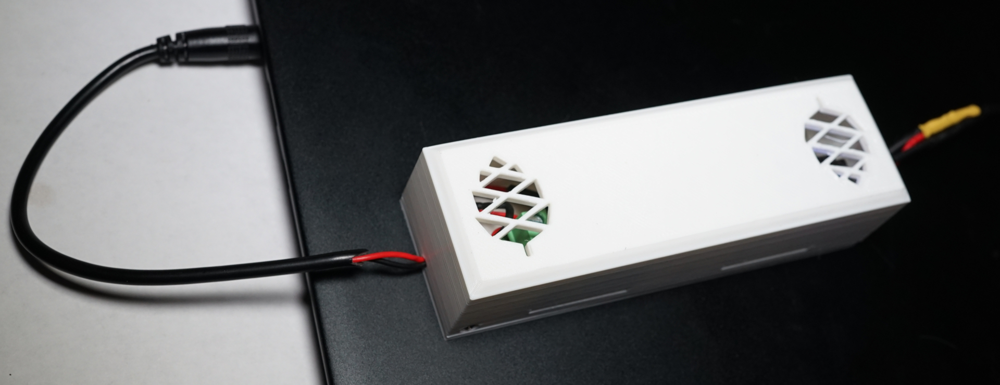
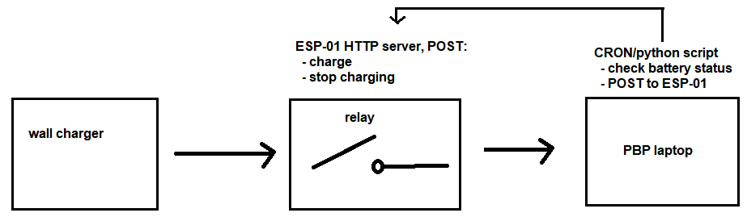
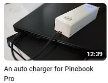

### Pinebook Pro Auto Charger

#### Disclaimer

I don't know what the implications are of pulling power from the designed source eg. 5V 3A.

So if you're interested in this, proceed at your own risk.

The setup pulls 2.58 Amps at 5V measured (at source eg. wall side) with bench top power supply when the ESP-01 shares power supply with the wall charger.

### Block diagram

### Reason

The PBP has a wake problem when going to sleep. Once it sleeps, doesn't wake up. I'm currently using the option where when you close the lid, the screen is just turned off (everything still on). The power draw is still up there eg. in 9 hours you lose 65% of charge. It's a pain to lose your progress... so this aims to just keep the laptop on all the time but hopefully have the battery last longer.

### Video (YouTube)

### You don't need a router

I should have realized this earlier but you can connect a laptop to an ESP-01 directly without a router in between.

I believe this is the AP mode or softAP (both).

So you don't have to have the limitation that I have added here where it's tied to the local WiFi router.
