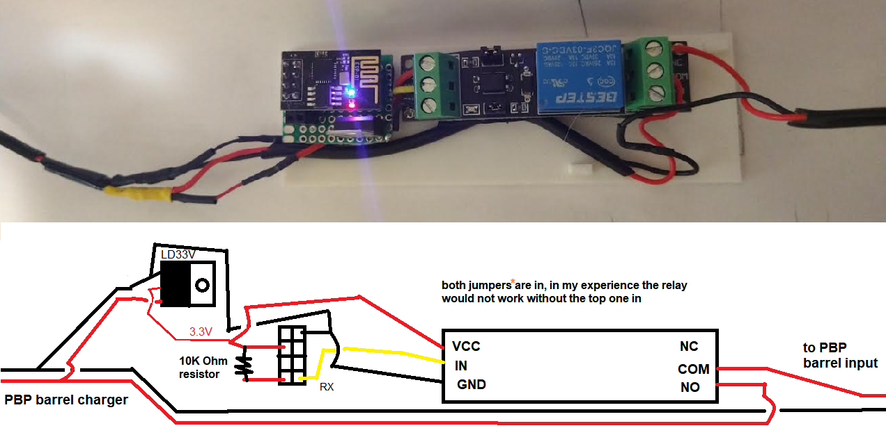

### Parts list and wiring diagram

#### Separate power supply (trigger on = charge)

#### Shared power supply (trigger on = stop charging)

Sorry for this crayon circuit lol

The green thing is a solderable breadboard or prototype pcb maybe, cut to size

